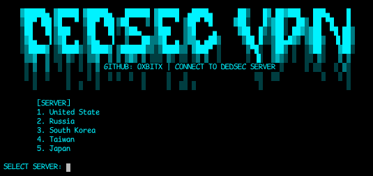

<h1 align="center"> DEDSEC VPN </h1>




<h3 align="center"> DEDSEC-VPN | Stay Anonymous </h3>
dedsec-vpn is a tool to bypass DNS blocks and also network censorship and surveillance. It is capable of routing all network traffic from the machine to the output node as well as encrypting this communication and the data passing through it. Even if you are on a school, company or public Wi-Fi network you can establish a connection to the VPN server.

### installation: 
```
git clone https://github.com/0xbitx/Dedsec-VPN.git
```
```
cd Dedsec-VPN
```
```
sudo pip install colorama
```

### usage:
```
sudo python3 dedsec-vpn.py
```

### Tested os:
```
kali linux
```
```
parrot os
```
<h1 align="center"> DISCLAIMER </h1>

<h4 align="center">I'm not responsible for anything you do with this program, so please only use it for good and educational purposes. </h4>

